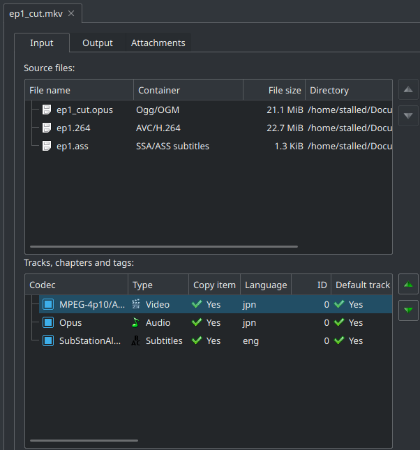
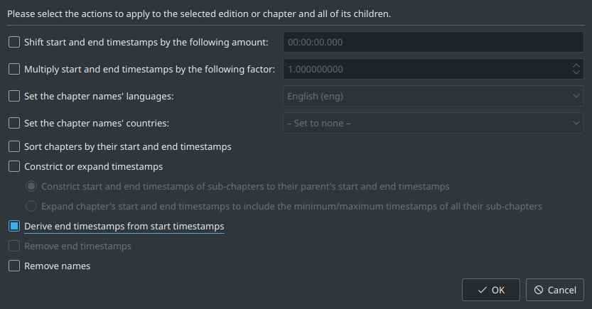
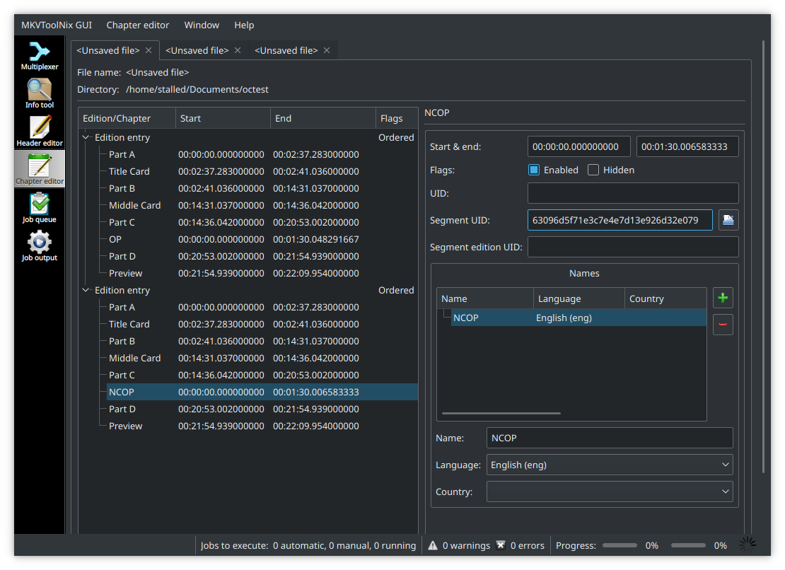

# Mastroka Container Tricks

*Disclaimer: this page assumes some basic knowledge of the mastroka container,
python,
and VapourSynth.*


## Background and Preparation

The Mastroka Media Container is an open source,
open standard multimedia container
that is heavily used in the fansubbing scene.
Mastroka video, or `.mkv` files
are the standard for soft-subbed releases
as they allow for multiple subtitles tracks and chapters
which are a somewhat unique feature to the container.
The MPEG-4 Part 14 or MP4 is another container format
but it is limited in its usefulness for fansubbing.

The following steps will require
VapourSynth,
[MKVToolNix GUI + CLI][toolnix],
a tool to demux transport stream files (i.e. [tsMuxeR][]),
and [FFmpeg][] to be installed
(or readily available as binaries).
A [mastroka-friendly player][mk-playback], preferably [MPC-HC][] or [mpv][],
will also be required for testing the files.

The examples will be using pre-made subtitle tracks,
a BDMV source,
[VSEdit](preparation.md#the-editor),
an [audio-cutting python script][acsuite.py],
and a [script to change frame numbers into timestamps][f2ts.py].

What we will be doing:
1. Creating mkv files from individual tracks
1. Creating chapters for said files
1. Creating virtual timelines with ordered chapters
1. Using multiple audio codecs in the same 'apparent file'
1. Creating a playall file with ordered chapters
1. Using editions to change between NCOP and OP

[toolnix]: https://mkvtoolnix.download/downloads.html
[tsMuxeR]: https://www.videohelp.com/software/tsMuxeR
[FFmpeg]: https://ffmpeg.zeranoe.com/builds/
[mk-playback]: https://github.com/hubblec4/Matroska-Playback/blob/e48149b500ce80c38ebc07ccf8f74f8af45e89b2/src/PlayerOverview.md
[MPC-HC]: https://github.com/clsid2/mpc-hc/releases
[mpv]: https://mpv.io/installation/
[acsuite.py]: https://github.com/OrangeChannel/acsuite/blob/04194ad6d4e65e491b5c09219d3f9e832651f2c0/acsuite.py
[f2ts.py]: https://gist.githubusercontent.com/OrangeChannel/330a032e4d6cf9265b8b007c41112937/raw/frame-to-timestamp.py


## Starting with trimming the video

Obviously, the goal here is not to teach how to encode,
but provided are examples of trims that may need to be made
to cut the OP/ED out of an episode,
and possibly any other unwanted frame-ranges
(some blu-ray streams have a silent black screen at the end,
which should be cut out).

Starting with four files,
our first step is to trim the main episodes out.
This requires knowing the frame ranges, shown below.
Second, we will crop out the NCOP/NCED files
as they also have unwanted frames at the end.

```py
import vapoursynth as vs
core = vs.core

bdmv =  core.lsmas.LWLibavSource(r'/BDMV/STREAM/00003.m2ts')
bdmv2 = core.lsmas.LWLibavSource(r'/BDMV/STREAM/00004.m2ts')
bdmv3 = core.lsmas.LWLibavSource(r'/BDMV/STREAM/00005.m2ts')
bdmv_NCOP = core.lsmas.LWLibavSource(r'/BDMV/STREAM/00007.m2ts')
bdmv_NCED = core.lsmas.LWLibavSource(r'/BDMV/STREAM/00008.m2ts')

ep1 = bdmv[:30042]+bdmv[32201:34046]
# 0-30041, 32201-34045 is main episode 1
ep2 = bdmv2[:1678]+bdmv2[3837:30978]+bdmv2[33111:34023]
# 0-1677, 3837-30977, 33111-34022 is main episode 2
ep3 = bdmv3[:1942]+bdmv3[4104:30474]+bdmv3[32609:34023]
# 0-1941, 4104-30473, 32609-24022 is main episode 3

op = bdmv[30042:32201] # the first time the OP plays is during episode 1
                       # 30042-32200 is the OP
ed = bdmv2[30978:33111] # the first time the ED plays is during episode 2
                        # 30978-33110 is the ED
ncop = bdmv_NCOP[:2158] # 0-2157 is the NCOP
nced = bdmv_NCED[:2133] # 0-2132 is the NCED
```

Assuming the codec used is h.264/AVC,
this will result in the following files:

- `vid_ep1.264`
- `vid_ep2.264`
- `vid_ep3.264`
- `vid_OP.264`
- `vid_ED.264`
- `vid_NCOP.264`
- `vid_NCED.264`


## Trimming the audio + generating chapters

In order to start the audio processing,
we first need to extract the audio track from the transport stream files.
Using the tsMuxeR GUI set to *demux* mode,
grab the likely pcm or dts audio streams,
only changing the extension.

- `00003.m2ts` > `00003.wav`
- `00004.m2ts` > `00004.wav`
- `00005.m2ts` > `00005.wav`
- `00007.m2ts` > `00007.wav`
- `00008.m2ts` > `00008.wav`

Now, either in a new python instance
or from within our VapourSynth script above,
we will use `acsuite.py` to trim our audio,
and generate chapter timings.
(The lines should be run one at a time,
and commented out when not in use. If running from within VSEdit,
you must name and save the script first if you do not specify full paths
for the `outfile` and/or `chapter_file`.)

**Note:** the frame numbers used in `ac.octrim(...)` and `ac.eztrim(...)`
are from the untrimmed source clips.
The exact syntax is explained in the docstrings for `acsuite.py`.

```py
...
import acsuite
ac = acsuite.AC()

afile =  r'/BDMV/STREAM/00003.wav' # 260.2 MiB
afile2 = r'/BDMV/STREAM/00004.wav' # 260.0 MiB
afile3 = r'/BDMV/STREAM/00005.wav' # 260.0 MiB
afile4 = r'/BDMV/STREAM/00007.wav' # 16.7 MiB
afile5 = r'/BDMV/STREAM/00008.wav' # 16.5 MiB

chap = [(0, 'Part A'), (3771, 'Title Card'),(3861, 'Part B'), (20884, 'Middle Card'), (21004, 30041, 'Part C'), (32201, 'Part D'), (33686, 34045, 'Preview')]
chap2 = [(0,1677,'Part A'),(3837,'Part B'),(17239,'Middle Card'),(17359,30977,'Part C'),(33111,'Part D'),(33663,34022,'Preview')]
chap3 = [(0,1941,'Part A'),(4104,'Part B'),(13668,'Middle Card'),(13788,30473,'Part C'),(32609,'Part D'),(33663,34022,'Preview')]

ac.octrim(bdmv, chap, afile, 'ep1_cut.wav', 'ep1_chapters.txt')
ac.octrim(bdmv2, chap2, afile2, 'ep2_cut.wav', 'ep2_chapters.txt')
ac.octrim(bdmv3, chap3, afile3, 'ep3_cut.wav', 'ep3_chapters.txt')

ac.eztrim(bdmv, (30042,32201), afile, 'op_cut.wav')
ac.eztrim(bdmv2, (30978,33111), afile2, 'ed_cut.wav')
ac.eztrim(bdmv_NCOP, (0,2158), afile4, 'ncop_cut.wav')
ac.eztrim(bdmv_NCED, (0,2133), afile5, 'nced_cut.wav')
```

This will result in the following files:

- `ep1_cut.wav`  (243.6 MiB)
- `ep2_cut.wav`  (227.1 MiB)
- `ep3_cut.wav`  (227.1 MiB)
- `op_cut.wav`   (16.5 MiB)
- `ed_cut.wav`   (16.3 MiB)
- `ncop_cut.wav` (16.5 MiB)
- `nced_cut.wav` (16.3 MiB)

and MKVToolNix GUI will open the following OGM chapter files:

- [ep1_chapters.txt][ep1txt]
- [ep2_chapters.txt][ep2txt]
- [ep3_chapters.txt][ep3txt]

[ep1txt]: https://github.com/OrangeChannel/mastroka-tricks-files/blob/cd1968bcb7bd73e720f8822c9c8375a563635e1b/ep1_chapters.txt
[ep2txt]: https://github.com/OrangeChannel/mastroka-tricks-files/blob/cd1968bcb7bd73e720f8822c9c8375a563635e1b/ep2_chapters.txt
[ep3txt]: https://github.com/OrangeChannel/mastroka-tricks-files/blob/cd1968bcb7bd73e720f8822c9c8375a563635e1b/ep3_chapters.txt


### Encoding the audio

We will be using FFmpeg's *libopus* and *flac* encoders.
The following examples simply loop[^1] the command for every `ep*.wav` file,
and all four op/ed files.

For the main episode, we will be using opus:

```sh
$ fd -e wav -E 'op*' -E 'ed*' -E 'nc*' -x ffmpeg -i {} -c:a libopus -b:a 128k -cutoff 20000 {.}.opus
```

And for the op/ed's, we will use FLAC:

```sh
$ fd -e wav -E 'ep*' -x ffmpeg -i {} -c:a flac -compression_level 12 {.}.flac
```

This results in the following files:

- `ep1_cut.opus`  (21.2 MiB) (91% reduction)
- `ep2_cut.opus`  (19.3 MiB) (91% reduction)
- `ep3_cut.opus`  (19.5 MiB) (91% reduction)
- `op_cut.flac`   (10.0 MiB) (39% reduction)
- `ed_cut.flac`   (9.9 MiB) (39% reduction)
- `ncop_cut.flac` (10.1 MiB) (39% reduction)
- `nced_cut.flac` (9.9 MiB) (39% reduction)

Normally, using two different audio codecs within the same file
would not be possible.
However, ordered chapters make it possible for each file to use its own codec
(as long as the track order is the same).

*For the audiophiles who like to keep their anime music lossless,
we've encoded only the OP/EDs with FLAC.
This leaves the episode to be compressed more efficiently with a lossy codec
such as opus, for those who don't like 'wasting' space with lossless audio.
Since we are encoding around 90%[^2] of the show with opus,
and only have the OP/ED + NCOP/NCED files occuring once,
the filesize difference and lossless music should satisfy both groups.
Normal dialogue should be nearly transparent at 128 kbps with opus,
but this comes with some caveats.
If there are 'insert' songs within an episode that you'd like to keep lossless,
you will need to encode the entire episode with a lossless codec.*


## Working with ordered chapters

### Muxing

Before we can start using ordered chapters,
we will have to mux the current files into mkv's.
This is because ordered chapters reference other mkv's by their UID
to generate the virtual timeline for the player.
MKVToolNix can save chapters *into* existing mkv files,
so this step will be the only time we mux.

This can be done with the MKVToolNix GUI,
in which case the order the tracks appear in the bottom list is important.
Although mpv will only warn that tracks are mismatched,
it is a good idea to keep the same track order in all of the mkv's.
In our example, we will use
*Video*, *Audio*, then *Subtitles*
as the order for every file.

The order can be changed with the arrows or by dragging the tracks
in the bottom box of the *Mulitplexer* window in the GUI:



This can also be done automatically using the command line.
An example python script:

```py
import shlex, subprocess

names = ['ep1', 'ep2', 'ep3', 'op', 'ed', 'ncop', 'nced']
audios = ['ep1_cut.opus', 'ep2_cut.opus', 'ep3_cut.opus', 'op_cut.flac', 'ed_cut.flac', 'ncop_cut.flac', 'nced_cut.flac']

for n, a in zip(names, audios):
    cmd = 'mkvmerge -o {0}.mkv {0}.264 {1} {0}.ass'.format(n, a)
    args = shlex.split(cmd)
    subprocess.Popen(args)
```

Since this is the only time we will actually be muxing,
all attachments should be added here as needed with their subtitle tracks
(if a font is used in `op.ass`, only add it to the `op.mkv` file).
Adding a title and setting track languages
should also be done at this point.


### Main episode

In the example above,
the *Chapter editor* GUI should at first look like this:


Ordered chapters require a start *and* an end timestamp,
so we will need to generate the *End* column here.
This can be accomplished by right-clicking the *Edition entry*,
and selecting *Additional modifications*.



After deriving the end timestamps,
delete the last chapter,
as it was a placeholder generated by `octrim()`
to determine the end timestamp of the last chapter.

On the *Edition entry*, we can now tick *Ordered*:


At this point, if we were to mux these chapters into our episode 1 file,
they will act like normal chapters,
and the episode will play without the OP towards the end.


### Adding in our OP

Before we add in the OP,
we need to determine the timestamps needed for the timeline
to reference our `op.mkv`.

If we had chapters generated for the OP,
we could simply copy over those timestamps
(we will do this with our *playall* file later).
Instead, we will simply use the number of frames in the entire op
to determine the end timestamp.

From our trim, `op = bdmv[30042:32201]`,
we find that the clip is $$32201-30042=2159$$ frames long.
This can also be found from `op.num_frames` in VapourSynth.

Using a small [script to change frame numbers into timestamps][f2ts.py],
we find that `2159 > 00:01:30.048291667`.

We will add a chapter titled *OP* between *Part C* and *Part D*,
where it was originally in the uncut video.


The timestamp above becomes this chapter's end timestamp.

Now, in order for the mkv to know what chapter this file comes from,
click the folder icon next to *Segment UID:* and open the `op.mkv` file.
This will automatically find the UID of the mkv
and input it for this chapter's SUID:


Players will only search within the current directory for referenced files,
so `op.mkv` must be kept in the same folder as our episode 1
if we want it appearing in the timeline.

```
File uses ordered chapters, will build edit timeline.
This file references data from other sources.
Will scan other files in the same directory to find referenced sources.
Match for source 1: ./op.mkv
Timeline segments have mismatching codec.
```

*Although mpv shows this mismatching codec warning,
playback is not affected.*

By adding this chapter,
any compatible player will add frames 0-2158 from the `op.mkv`
into the timeline of `ep1.mkv` when episode 1 is played.
The `op.mkv` file will remain unaffected,
meaning it can be played separately on its own.


[f2ts.py]: https://gist.githubusercontent.com/OrangeChannel/330a032e4d6cf9265b8b007c41112937/raw/frame-to-timestamp.py


### Using editions to add in an NCOP

Similar to adding in the OP,
we will find the timestamp for the NCOP clip.
`ncop = bdmv_NCOP[:2158]` > $$2158-0=2158$$ therefore, `2158 > 00:01:30.006583333`.

Using the same *Chapter editor* GUI,
duplicate our first *Edition entry*.
Rename the *OP* chapter to *NCOP*,
modify the end timestamp,
and change the SUID by opening `ncop.mkv` with the folder button:



Note: *Although it doesn't affect playback,
duplicating the chapters' UIDs is not ideal.
The only way around this is to delete the string in the *UID* field for
any chapter that is duplicating another.
Upon saving the file,
new UIDs will be generated.*

At this point,
we are done with this episode's timelines,
so we will *Chapter editor > Save to Mastroka or WebM file*
and select our already muxed `01.mkv`.
On playback, you should now see the OP chapter
inserted towards the end of the episode seamlessly.

---


#### Advanced edition tagging

*You can skip this section if you're not using editions,
or if you don't want to bother with re-muxing.*

By default, the two editions we've created above will not have names.
Players will likely show either their number or a blank title.
However, there is a way to name editions with a *tags* file.
If we erase what's currently in the *UID* field for both of our editions
(as the duplication we did above may have copied the UID),
and then save this to a normal xml chapters file,
we can find our *EditionUID* that we need to proceed.

*At this point, the chapters should be finalized.*

Using yet another [tiny script][e-namer] to automate this,
we will generate a tags xml file with our wanted names.

```sh
$ python edition-namer.py
input the edition uids (2906622092 4906785091): 4972756538813441817 3956363165969893955
input the edition names ('normal' 'no credits'): 'Normal' 'No-Credits'
desired file name (example.xml): ep1_editions.xml
```

[ep1_editions.xml][]

In order to get these tags to work,
you need to mux this tags file under *Global tags*.
On the Multiplexer GUI, *Output > General > Global tags*.
This file must be muxed with the original tracks,
and probably should be muxed along with the chapters
(*Output > Chapters > Chapter file*)
as they are now both final.

[e-namer]: https://gist.githubusercontent.com/OrangeChannel/b14f7142c5814d86454da8cde7ec5a94/raw/edition-namer.py
[ep1_editions.xml]: https://github.com/OrangeChannel/mastroka-tricks-files/blob/20429481f7479de9500124673d10917b0642e4fe/ep1_editions.xml


### Creating a playall file

At this point, you should be comfortable with how ordered-chapters work.
Using the ideas above,
we are going to create a small `playall.mkv` file that will generate
a virtual timeline of our 3 episodes, and the OP/ED once.
Originally, the order was:

```
Ep1:
ep1_A + OP + ep1_B + preview1

Ep2:
ep2_A + OP + ep2_B + ED + ep2_C + preview2

Ep3:
ep3_A + OP + ep3_B + ED + ep3_C + preview3
```

Our goal is to create a small file that when played,
creates the following timeline...

```
ep1_A + OP + ep1_B + ep2_A + ep2_B + ep2_C + ep3_A + ep3_B + ED + ep3_C
```

...with the OP occurring at the same point it first happened in the source,
and the ED occurring at the same point it last happened in the source.
In reality, if we had all 12 episodes to work with,
we could put the ED at the *real* last time it plays
(likely towards the end of ep12).

---

[^1]: the `fd` utility can be installed from its [GitHub repo][fd]

[^2]: This number is actually much higher as we only encode the music once. Assuming a 12 episode show, with 24 minutes per episode and 3 minutes of OP/ED music in each episode, we would be encoding 255 minutes total, with only 3 minutes (1.2%) being the lossless music.

[fd]: https://github.com/sharkdp/fd/releases
